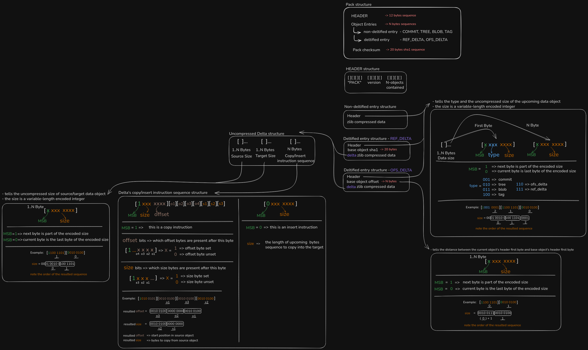

---

## Overview

This project is my implementation of the **“Build Your Own Git”** challenge from [Codecrafters](https://codecrafters.io/challenges/git).

It reproduces Git’s core functionality, including:

* **`git init`** - Initialize a new repository with a `.git` directory.
* **`git cat-file`** - Inspect object content and metadata.
* **`git hash-object`** - Hash files into Git object format.
* **`git ls-tree`** - Explore tree structures and file hierarchies.
* **`git write-tree`** - Build tree objects from the working directory.
* **`git commit-tree`** - Create commit objects linking trees and parents.
* **`git clone`** - Clone a repository from a remote server (this one was especially challenging!).

> The goal: gain a deep understanding of how Git works under the hood by building it step by step.

---

## Git Pack File Structure

While implementing **`git clone`**, I dug into the **Pack file format** - a compact, efficient way Git stores objects. I put together a visual representation to make sense of it and keep it handy for reference:

🔗 [Open in Excalidraw for full zoomable detail](https://excalidraw.com/#json=KKyM_kdrz2KYSZi9eje8o,SOjy8ajQCPUxh_XBQnVk2A)

> If the link doesn’t work, you can also find the `.excalidraw` file in the repo root.

---